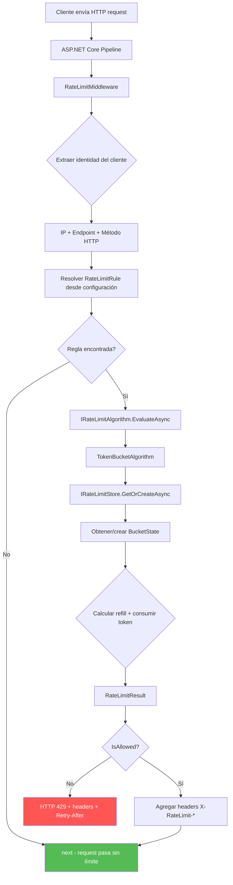
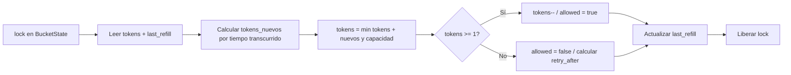

# Rate Limiter — Decisiones de Arquitectura

## 1. Arquitectura: 3 capas sin Application

```
RateLimiter.Api  →  RateLimiter.Domain  ←  RateLimiter.Infrastructure
(HTTP, middleware)    (algoritmos, interfaces)   (storage concreto)
```

La estructura sigue Clean Architecture con una modificación deliberada: **no existe capa Application**.

En Clean Architecture canónica, Application contiene casos de uso que orquestan servicios de dominio. En este problema, el único caso de uso es "evaluar si un request pasa o no", que se resuelve con una sola llamada a `IRateLimitAlgorithm.EvaluateAsync()`. Una capa Application aquí sería un pass-through:

```csharp
// Esto es lo que Application haría — delegar sin agregar valor
public class RateLimitService
{
    public Task<RateLimitResult> Check(string key, RateLimitRule rule)
        => _algorithm.EvaluateAsync(key, rule);
}
```

Siguiendo el principio de **módulos profundos** de APOSD (A Philosophy of Software Design, John Ousterhout): una clase cuya interfaz es tan compleja como su implementación no oculta nada. Application sería un módulo shallow — aumenta la superficie del sistema sin reducir su complejidad cognitiva.

**Cuándo agregarla:** Si el sistema evolucionara para orquestar rate limiting + audit logging + analytics + billing en una sola operación, ahí Application tendría complejidad real que justifique su existencia.

### Dependencias entre capas

| Capa | Depende de | Responsabilidad |
|---|---|---|
| **Domain** | Nada | Algoritmos, interfaces, modelos de valor |
| **Infrastructure** | Domain | Implementación de `IRateLimitStore` con `ConcurrentDictionary` |
| **Api** | Domain, Infrastructure | Middleware HTTP, DI, configuración, response mapping |

La inversión de dependencias se mantiene: Domain define `IRateLimitStore`, Infrastructure la implementa, Api registra el binding en DI.

---

## 2. Algoritmo: Token Bucket

### Cómo funciona

Cada cliente tiene un bucket virtual con capacidad `N` tokens. Cada request consume 1 token. Los tokens se recargan a una tasa fija (ej: 10 tokens/segundo). Si el bucket está vacío, el request se rechaza.

El refill no ocurre en background con un timer. Se calcula **lazy** al momento de cada request:

```
tokens_a_agregar = (ahora - ultimo_refill) * tasa_de_refill
nuevos_tokens = min(tokens_actuales + tokens_a_agregar, capacidad_maxima)
```

Esto elimina la necesidad de un proceso concurrente de recarga y reduce el estado a dos valores por cliente: `tokens_disponibles` y `ultimo_timestamp_de_refill`.

### Por qué Token Bucket y no otro

| Criterio | Token Bucket | Sliding Window Log | Sliding Window Counter | Fixed Window |
|---|---|---|---|---|
| Memoria por cliente | 2 valores (tokens + timestamp) | Lista de todos los timestamps | 2 contadores + timestamp | 1 contador |
| Precisión | Exacta para la tasa promedio | Exacta | Aproximada (~99.7%) | Problema de borde de ventana |
| Bursts | Permite bursts controlados (hasta N tokens) | No permite bursts | Suaviza bursts | Doble tráfico en bordes |
| Uso en producción | AWS, Stripe, Cloudflare | Poco usado por costo de memoria | Cloudflare (variante) | Implementaciones simples |
| Complejidad de implementación | Media | Baja (pero ineficiente) | Media-alta | Baja |

**Elección:** Token Bucket por tres razones concretas:
1. **Memoria O(1) por cliente** — con millones de clientes, guardar 2 valores vs una lista de timestamps es la diferencia entre MB y GB.
2. **Bursts controlados** — en APIs reales, un cliente legítimo puede hacer 5 requests instantáneos y luego nada por 10 segundos. Token Bucket permite esto naturalmente; Sliding Window Log lo rechazaría.
3. **Probado en producción** — AWS API Gateway, Stripe, y NGINX usan variantes de Token Bucket.

**Trade-off aceptado:** Los dos parámetros (capacidad del bucket + tasa de refill) requieren tuning. Para un MVP esto se resuelve con configuración en `appsettings.json`; en producción se ajustaría con métricas.

---

## 3. Flujo de un request



### Detalle del cálculo atómico dentro del algoritmo



---

## 4. Diseño de interfaces

### `IRateLimitAlgorithm` — Un solo método

```csharp
public interface IRateLimitAlgorithm
{
    Task<RateLimitResult> EvaluateAsync(
        string clientKey, RateLimitRule rule, CancellationToken ct = default);
}
```

**Por qué un solo método:** El rate limiter tiene una única operación semánticamente significativa: decidir si un request pasa. No hay operaciones separadas de "consultar estado" y "consumir token" — separarlas introduciría race conditions entre la lectura y la escritura. La atomicidad está encapsulada dentro de la implementación.

**Qué oculta este método:** El `TokenBucketAlgorithm` detrás de esta interfaz esconde:
- Cálculo de refill basado en `DateTime` elapsed.
- Locking por key individual (no lock global).
- Conversión de estado interno a `RateLimitResult` con `Remaining` y `RetryAfterSeconds`.
- Interacción con `IRateLimitStore` para persistencia.

Esto cumple el criterio de módulo profundo: interfaz mínima (1 método, 3 parámetros), implementación sustancial (~80-100 líneas de lógica no trivial).

### `IRateLimitStore` — Concurrencia invisible

```csharp
public interface IRateLimitStore
{
    Task<T> GetOrCreateAsync<T>(string key, Func<T> factory) where T : class;
    Task RemoveExpiredEntriesAsync(CancellationToken ct = default);
}
```

**Por qué esconder la concurrencia:** El consumidor (el algoritmo) solo necesita "dame el estado para este cliente, o crealo si no existe". No le importa si es un `ConcurrentDictionary`, un Redis `GET`/`SET`, o una base de datos. Toda la complejidad de:
- `ConcurrentDictionary.GetOrAdd` con sus garantías de thread-safety
- Cleanup periódico de entries expiradas
- Futuro: serialización/deserialización, conexión a Redis, Lua scripts atómicos

...queda detrás de estos dos métodos.

**Decisión sobre locking:** El lock por operación atómica (refill + consumo) lo maneja el algoritmo, no el store. El store solo garantiza acceso thread-safe al objeto de estado. Esto permite que distintos algoritmos implementen su propia estrategia de atomicidad sin que el store necesite conocer la lógica de negocio.

### Modelos de valor

```csharp
public record RateLimitRule(
    int Limit, TimeSpan Window, int? BucketCapacity, double? RefillRate);

public record RateLimitResult(
    bool IsAllowed, int Limit, int Remaining, int? RetryAfterSeconds);

public record ClientRequestInfo(
    string ClientIp, string? UserId, string Endpoint, string HttpMethod);
```

Son records inmutables. No hay lógica de negocio en ellos — su única responsabilidad es transportar datos entre capas de forma type-safe. Usar records en vez de clases evita boilerplate de `Equals`/`GetHashCode` y comunica intención de inmutabilidad.

---

## 5. Módulos shallow identificados y eliminados

| Candidato | Por qué sería shallow | Decisión |
|---|---|---|
| **Capa Application** | El único "caso de uso" (evaluar rate limit) es una delegación directa a Domain. No orquesta múltiples servicios ni transforma datos. | **Eliminada** — el middleware en Api llama a Domain directamente. |
| **`IRateLimitRuleProvider`** | ASP.NET Core ya resuelve configuración con `IOptions<T>`. Crear una interfaz propia para wrappear `IOptions` no oculta complejidad nueva. | **No creada** — se usa `IOptions<RateLimitOptions>` directamente. |
| **`ClientIdentifierExtractor`** | Extraer IP de `HttpContext.Connection.RemoteIpAddress` y armar un key es un método de ~5 líneas. No justifica una clase con interfaz, constructor, y registro en DI. | **Método privado** dentro de `RateLimitMiddleware`. |
| **`RateLimitResponseWriter`** | Escribir 3 headers HTTP y un JSON body de error es trivial. Extraerlo a una clase con su propia interfaz duplica la superficie sin reducir complejidad. | **Método privado** dentro de `RateLimitMiddleware`. |
| **`AlgorithmFactory`** | Con un solo algoritmo implementado, un factory pattern es prematura abstracción. Cuando haya 2+ algoritmos, se puede agregar. | **No creado** — se registra `TokenBucketAlgorithm` directamente en DI. |

---

## 6. Mejoras con más tiempo

### Prioridad alta
- **Redis como store distribuido:** Reemplazar `InMemoryRateLimitStore` por una implementación con `StackExchange.Redis`. La operación atómica de refill + consumo se haría con un Lua script para evitar round-trips. La interfaz `IRateLimitStore` ya está preparada para este swap.
- **Sliding Window Counter como segundo algoritmo:** Para endpoints donde no se quieren bursts (ej: creación de cuentas), es más apropiado que Token Bucket. Registrar distintos algoritmos por regla.

### Prioridad media
- **Métricas con Prometheus/OpenTelemetry:** Contadores de requests allowed/denied por endpoint, histograma de tokens restantes, alertas cuando un cliente está consistentemente throttled.
- **Rate limit por múltiples dimensiones:** Componer reglas — ej: máx 100 req/min por IP AND máx 1000 req/min por endpoint globalmente.
- **Circuit breaker en el middleware:** Si el store (Redis) falla, el sistema hace fail-open por X segundos en vez de rechazar todo el tráfico.

### Prioridad baja
- **Dashboard de rate limiting:** UI para ver qué clientes están siendo throttled y ajustar reglas en runtime.
- **Dynamic rule loading:** Cambiar reglas sin redeploy (via Redis pub/sub o polling a una config store).
- **Response caching:** Si un request es rechazado, cachear la respuesta 429 por `RetryAfter` segundos para ni siquiera evaluar el algoritmo.

---

## 7. Uso de IA en el proceso

### Qué hizo Claude Code

- **Análisis de capas:** Se usó como sparring partner para evaluar si cada capa de Clean Architecture tenía profundidad real en este problema específico. El análisis de Application como shallow module surgió de esta discusión.
- **Generación de este documento:** La estructura, diagramas Mermaid, y tablas comparativas fueron generados por Claude Code a partir de las decisiones tomadas en la conversación.
- **Identificación de módulos shallow:** La tabla de candidatos eliminados se construyó iterativamente — se propusieron abstracciones y se descartaron las que no pasaban el filtro de "¿qué complejidad oculta?".

### Qué decisiones fueron humanas

- La elección de Token Bucket sobre otros algoritmos fue decisión propia basada en el caso de uso que se le puede dar a la empresa IOL.
- La estructura de 3 capas (eliminando Application) fue una decisión de diseño del desarrollador, validada contra los principios de APOSD.
- Los criterios de evaluación de shallow vs deep modules fueron aplicados por el desarrollador usando el framework de Ousterhout.

### Qué se corrigió

- Propuestas iniciales de interfaces más complejas para `IRateLimitStore` (con genéricos anidados y callbacks) se simplificaron manualmente a dos métodos concretos.
- Se eliminaron abstracciones sugeridas que no pasaban el filtro de profundidad (factory, extractor, response writer).

---

## 8. Deuda técnica conocida

### Race condition en limpieza del store (Low)

`InMemoryRateLimitStore` tiene una race condition teórica entre `RemoveExpiredEntriesAsync` y `GetOrCreateAsync`. Si la limpieza elimina una entrada exactamente mientras un request la está leyendo, el `_lastAccess` puede quedar desincronizado de `_entries`, forzando un reset inesperado del bucket de ese cliente en la siguiente solicitud.

**Por qué no se corrige ahora:** Requiere sincronizar ambos `ConcurrentDictionary` de forma atómica, lo que agrega un lock global que degrada el throughput. El impacto real es mínimo (ocurre solo si el cleanup de 5 minutos y un request del mismo cliente coinciden en milisegundos; el peor efecto es que ese cliente recupera el bucket lleno momentáneamente).

**Resolución natural:** Cuando se implemente el store distribuido con Redis, la atomicidad de refill + consumo + expiración se resuelve con Lua scripts, eliminando este problema de raíz.
